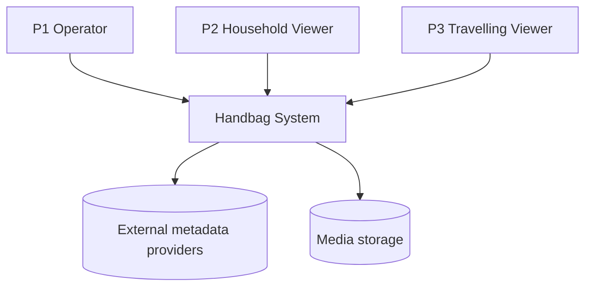

# Architecture

> **DRAFT.** Fills in as the requirements stabilise. We'll use the
> [C4 model](https://c4model.com/) (Context → Container → Component) and capture
> diagrams as Mermaid where possible so they're diffable in-repo.

## 1. System context (who/what interacts with Handbag)

## 2. Containers (high-level building blocks)

_To define: media server/API, transcoder, metadata service, database, client apps,
remote-access component. Direct-play vs transcode path. Where state lives._

## 3. Key decisions

Tracked as [ADRs](../adr/README.md). Big ones still open:

- Implementation stack (server, clients)
- Streaming transport (HLS/DASH/progressive; direct-play negotiation)
- Transcoding engine (FFmpeg integration model; hardware acceleration)
- Remote-access transport (relay vs reverse-tunnel vs VPN vs direct port-forward)
- Metadata provider strategy and caching
- Persistence (relational vs document; what stores library/state)

## 4. Cross-cutting concerns

_Security/threat model, observability, configuration, packaging/deployment._
